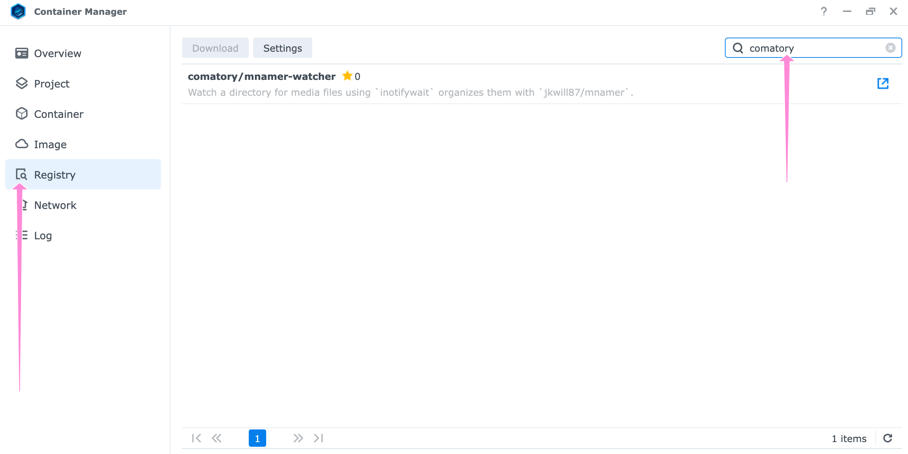
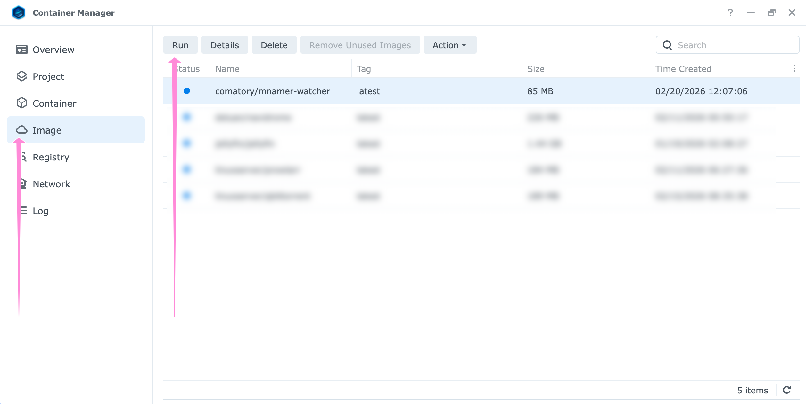
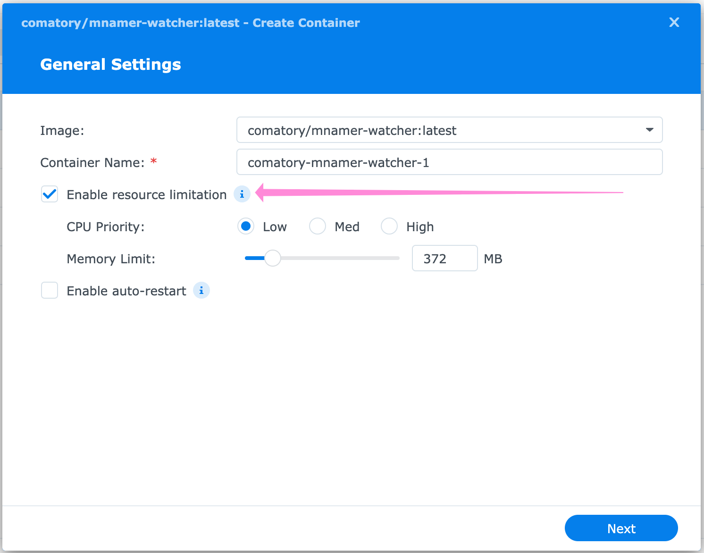
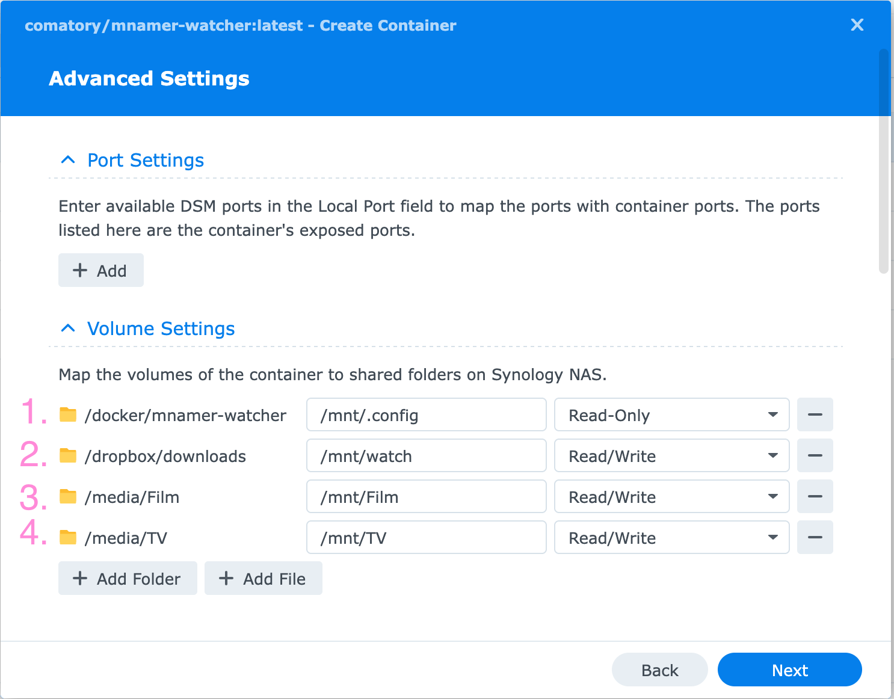
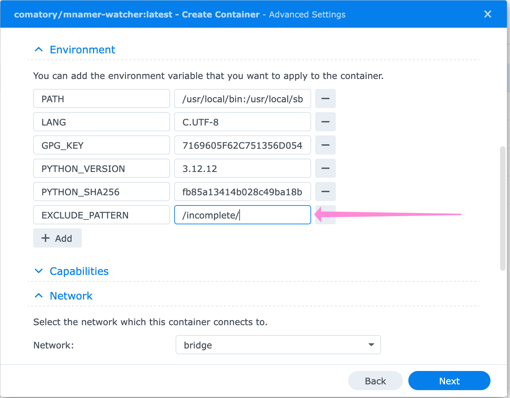
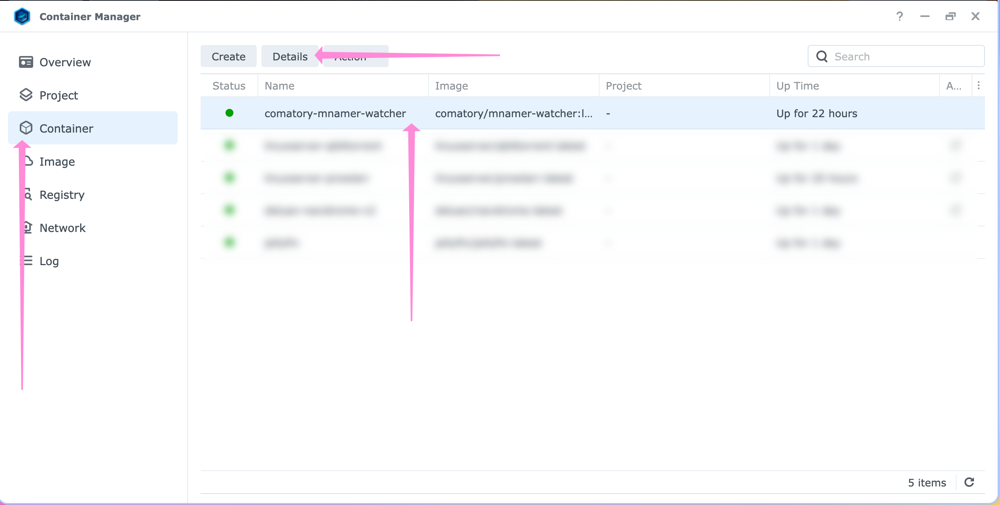
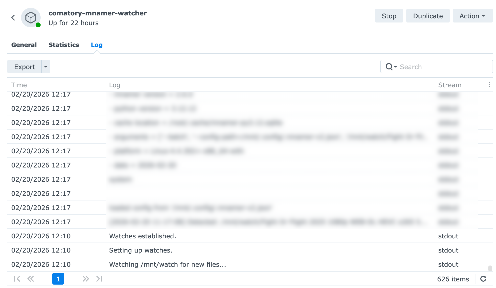

# mnamer-watcher

Watches a directory for new/moved media files using `inotifywait` and automatically organizes them with [mnamer](https://github.com/jkwill87/mnamer).

> **Linux only**: relies on `inotify` which requires a native Linux kernel. Bind-mounted volumes from macOS/Windows hosts do not propagate filesystem events to the container.

## Use

`docker pull comatory/mnamer-watcher:latest` from [docker hub](https://hub.docker.com/repositories/comatory)

## Build

```bash
docker build -t mnamer-watcher .
```

## Run

```bash
docker run -d \
  --name mnamer-watcher \
  --volume /path/to/downloads:/mnt/watch \
  --volume /path/to/config:/mnt/.config \
  --volume /path/to/movies:/mnt/movies \
  --volume /path/to/tv:/mnt/tv \
  mnamer-watcher
```

## Volumes

| Container path | Required | Description |
|---|---|---|
| `/mnt/watch` | yes | Directory watched recursively for new/moved files |
| `/mnt/.config` | yes | mnamer config directory (must contain `.mnamer-v2.json`) |
| `/mnt/movies` | no | Movie output directory (must match `movie_directory` in config) |
| `/mnt/tv` | no | TV output directory (must match `episode_directory` in config) |

## Environment variables

| Variable | Default | Description |
|---|---|---|
| `MNAMER_CONFIG` | `/mnt/.config/.mnamer-v2.json` | Path to mnamer config file |
| `EXCLUDE_PATTERN` | `/incomplete/` | Regex pattern for inotifywait `--exclude`, set empty to disable |

## mnamer config

**Config file must be provided**, otherwise `mnamer` will be used with the default options. All mnamer behavior is controlled via config file, no flags are passed beyond `--batch`[^1] and `--config-path`. The config file must be named `.mnamer-v2.json`. The `movie_directory` and `episode_directory` paths in the config must match the container mount points (e.g. `/mnt/movies`, `/mnt/tv`).

See [mnamer settings docs](https://github.com/jkwill87/mnamer/wiki/Settings) for all available options.

<details>
    <summary>Example configuration file</summary>
    
    ```json
    {
    "api_key_omdb": null,
    "api_key_tmdb": "<your-api-key>",
    "api_key_tvdb": null,
    "api_key_tvmaze": null,
    "batch": true,
    "episode_api": "tvmaze",
    "episode_directory": "/mnt/TV",
    "episode_format": "{series} [{id_tvmaze}]/Season {season}/{series} - S{season:02}E{episode:02} - {title}.{extension}",
    "hits": 5,
    "ignore": [
        ".*sample.*",
        "^RARBG.*"
    ],
    "language": null,
    "lower": false,
    "mask": [
        ".avi",
        ".m4v",
        ".mp4",
        ".mkv",
        ".ts",
        ".wmv",
        ".srt",
        ".idx",
        ".sub"
    ],
    "movie_api": "tmdb",
    "movie_directory": "/mnt/Film",
    "movie_format": "{name} ({year})[{id_tmdb}]/{name} ({year}) - {quality}.{extension}",
    "no_guess": false,
    "no_overwrite": false,
    "no_style": false,
    "recurse": true,
    "replace_after": {
        "&": "and",
        ";": ",",
        "@": "at"
    },
    "replace_before": {},
    "scene": false,
    "verbose": true
}

    ```
</details>

## Guides

### Synology NAS

_This guide assumes that you're using DSM7 of the operating system_.

1. Open _Container Manager_, select _Registry_ tab and search for the docker image: `comatory/mnamer-watcher`. Select it and click the download button:
  
2. Once it's downloaded, the image should show up in _Image_ tab. Select it and click _Run_ button:
  
3. Now we're setting up the container. It's not necessary for the container to auto-restart, but you can set it up if you need to. It's good idea to set up some resource constraints. Click _Next_ when you're done.
  
4. This image does not expose any UI, so no port forwarding is needed. But it's important to set the volumes correctly, see [volumes](#volumes) section:
  

    The `/mnt/.config` mount point `(1)` should point to a folder which contains `.mnamer-v2.json` configuration file. The `/mnt/watch` mount point `(2)` is where your download folder is located. This is where the `mnamer` will scan for new files and folders. For mount points `/mnt/Film` and `/mnt/TV` `(3, 4)` - these can be anything really. It's important they correspond to the configuration file settings for `movie_directory` and `episode_directory`.
  
5. In this example, I configure `EXCLUDE_PATTERN` environment variable to ignore any files appearing in `incomplete/` subfolder. You can specify multiple locations using `|` operator. This is completely optional, if you store incomplete downloads outside of `/mnt/watch`, you don't need to worry about this.
  
6. You don't need to set any other settings here if you don't need to. Click _Next_ button, check to run the container after creating it and click _Done_.
7. Go to _Container_ tab, select the created container and click _Details_ button.
  
8. Click _Log_ tab. If the container started successfully, you should see log such as: `Watches established`:
  
9. Try adding a media file to the watched folder. You should see further logs from `mnamer` to see whether the file was processed and where it was moved.

## Troubleshooting

### Synology NAS

The Synology kernel has low default inotify limits. SSH into the NAS and run:

```bash
echo 256 | sudo tee /proc/sys/fs/inotify/max_user_instances
echo 65536 | sudo tee /proc/sys/fs/inotify/max_user_watches
```

To persist across reboots, add a boot-up task in Control Panel → Task Scheduler → Create → Triggered Task → Boot-up (run as `root`):

```bash
echo 256 > /proc/sys/fs/inotify/max_user_instances
echo 65536 > /proc/sys/fs/inotify/max_user_watches
```

[^1]: `--batch` flag ensures that the program can work headless (without user interaction)
